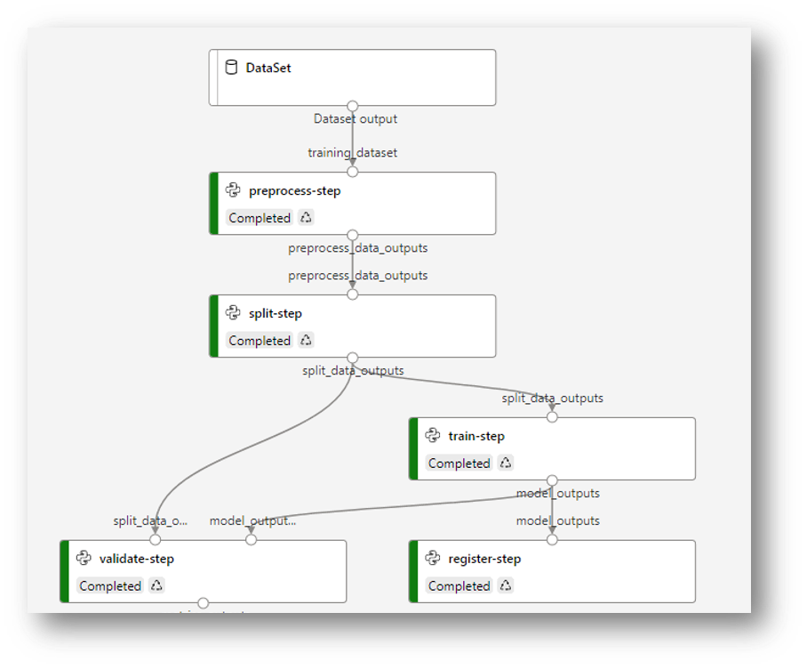

# balance-predictor
This is a project for demonstrating MLOps. It will showcase how a balance predictor can be built and operated in production.

The pipeline for building the predictor is shown in Figure 1. There is a [source code script](./src) for every step, written in Python classes.
There are [tests](./tests) written to ensure every function performs as expected.
Then each module is wrapped to a [service](./pipeline) with an individual endpoint using FastApi.
The orchestration of these services is done in bash scripts.
In addition, Docker is also used for containerising the whole pipeline


_Figure 1. Machine learning pipeline for building a balance predictor._

# Setting up the project

If for some reason you are not able to run the `make venv` command, please make sure you have performed something similiar to the following steps:

```bash
pip install cython # Expected to be installed by some of our dependencies, but not implicitly installed.
pip install -e . # Editable, local install of the current code base
pip install -r requirements.txt
pip install -r requirements-dev.txt
```
# Running the pipeline

(TODO: please update this)
To run the pipeline, use the `run_pipeline.sh` command, it will perform the full pipeline and show the scores.

# Running the services using Docker
... TODO

# Scoring for a prediction
Use `run_scorer.sh` for scoring a predictions. 
It requires two arguments: 
1) input data (i.e. a new transaction history) 
2) model (optional) If null, the script will pick up ?? for scoring.

# External Dependencies
```bash

# OpenSUSE
zypper addrepo https://download.opensuse.org/repositories/science/openSUSE_Tumbleweed/science.repo
zypper install lapack gcc-fortran gcc-c++ 
```
